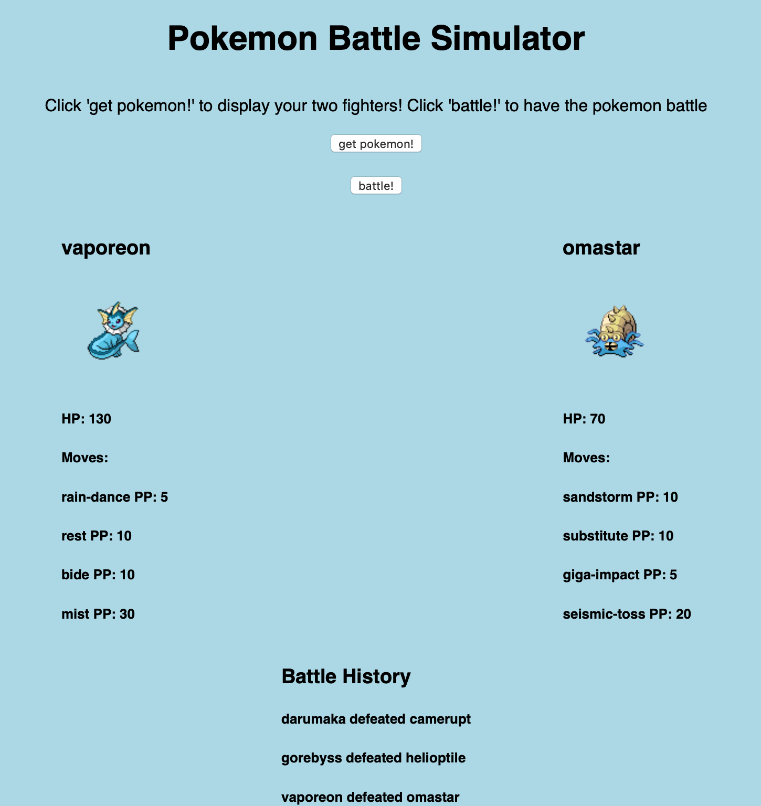

## Loading Data from API Lab

## Pokemon Battle Simulator

Create an app that simulates Pokemon Battles. 

Create a page with five items:

- An `h1` tag containing the words "Pokemon Battle Simulator"
- A button that displays the text "get pokemon!" and when clicked triggers the function "getPokemon"
- A button that displays the text "battle!" and when clicked triggers the function "battlePokemon"
- An empty `div` with the class `data`
- An `div` with the class `battleHistory` that contains a `h3` tag containing the words "Battle History"

You should have a script.js file that at minimum contains the following functions:
- getPokemon
- battlePokemon

Each time your user clicks the 'get pokemon' button and thereby triggers the getPokemon function, the following must occur:

- Call the PokéAPI api/v2/pokemon/{$pokemonID} endpoint **twice** to get the json data for two pokemon. These are your battlers. 
- For each of the two pokemon, the following information needs to be displayed
- The Pokemon's Name in a `h3` tag.
- A `h3` tag containing the pokemon's name.
- A `img` element containing the pokemon's sprite, with a height of 100 and a width of 100. 
- A `h5` tag containing the pokemon's base HP stat. 
- The names and PP of **four** of the Pokemon's moves (either get the first four moves or at random), each in a `h5` tag containing the words '{pokemonMoveName} PP: {movePP}'.

Each time the 'get pokemon' button is clicked, replace your old `data` div with a new `data` div that contains two `div` children. Each of the two `div` children should contain the `h5` tags, `h3` tag,  and `img` element. 

Each time the 'get pokemon' button is clicked, two new pokemon should be displayed. This means that if the button was clicked previously, the old two pokemon from the previous click should no longer be displayed.

The PokéAPI is documented at https://pokeapi.co.
You will use the api/v2/pokemon/{$pokemonID} endpoint to get data about a specific pokemon, and the api/v2/move/${moveID} endpoint to get data for a specific move.

- api/v2/pokemon/{$pokemonID} endpoint documentation: https://pokeapi.co/docs/v2.html#pokemon
- api/v2/move/{$moveID} endpoint documentation https://pokeapi.co/docs/v2.html/#moves

Each time your user clicks the 'battle' button, one of your two pokemon should be randomly selected as the winner. Append to the `battleHistory` div class an `h5` tag containing the text  
'{$winningPokemonName} defeated {$losingPokemonName}'. See picture for an example.

Things to consider:
- As of 9/12/2019, PokemonIDs range from 1 to 809.
- Within the 'sprites' json field, multiple sprites are present for each pokemon. Just use one sprite per pokemon.
- The HP base stat can be found within the 'stats' json field. 
- To get the PP of a move, you will need to call the api/v2//move/${moveID} endpoint to get the json data for a move.

Bonuses:
- When the battle button is pressed, have one of the pokemon 'attack' by using a move. Reflect this by decreasing the PP for that move by one, and lowering the HP of the pokemon that isn't attacking. You can append to
to the battle history an `h5` tag containing the words `{atttackingPokemonName} used {moveName} against {defendingPokemonName}`.
- If you are getting pokemon or pokemon moves at random, ensure that no duplicates are returned, i.e that it's impossible for your function
  to get a move more than once or the same pokemon to battle each other.  

## Styling

On top of default HTML styling, the app should have the following styles:

- **Entire App**

  - Fonts should be sans-serif.
  - The background color should be `lightblue`.
  - Everything should be in a column, justified center.

- **h1**

  - Include 30px of padding or margin on top.

- **data**
  - Should have a width of 600px.
  - The first pokemon should float left, the second pokemon
  should float right. See picture. 

For a video of how the page changes when the buttons are clicked visit https://youtu.be/_XVy4hRZ_Ig

It should end up looking something like this:

 api_loading_lab

Contributor: Mauricio Rivera, mauricio@pursuit.org
